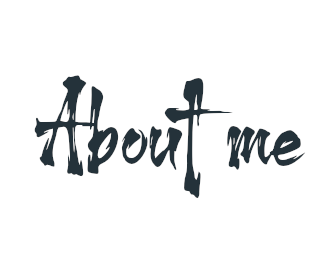
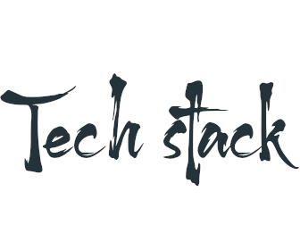

> **„[...] Nur vom Ich aus und seiner weiterwirkenden Entscheidung lässt sich über das Ich hinauswachsen, kein objektives Gehäuse fasst uns, wir müssen unser Haus selbst bauen.“**  
> — Theodor W. Adorno, ca. 1923, zit. in *Trauer und Trost der Musik* (Phaïdra‑Archiv, Univ. Wien)
> 
> **"[...] Only from the self and its continuing decision can one grow beyond the self; no objective shell can contain us, we must build our own house."**  
> — Theodor W. Adorno, c. 1923, quoted in *Mourning and Consolation of Music* (Phaïdra Archive, University of Vienna)

---
# 

## hdi10
I love technology related to IoT and Android.

*   Founder of [Zelkulon UG (haftungsbeschränkt)](https://zelkulon.com)

*   Building scalable microservice platforms for Web & Mobile

*   Working on smart IoT solutions and connected Android apps

# 

Currently developing products and services in:

*   Java / Kotlin / Spring Boot

*   Next.js / TypeScript

*    Embedded IoT systems

  
  
  
  
  

---

# 
**Backend**\

**Frontend**\

**Testing & Automation**\

---

# 
- **Printzone24** – Microservice-based print shop platform with Spring Boot & PostgreSQL  
- **BeatLog** – Spotify analytics service with OAuth2, Elasticsearch & Android App  
- **Godot SandStorm** – C# sandbox game with multiple materials and physics interactions  

